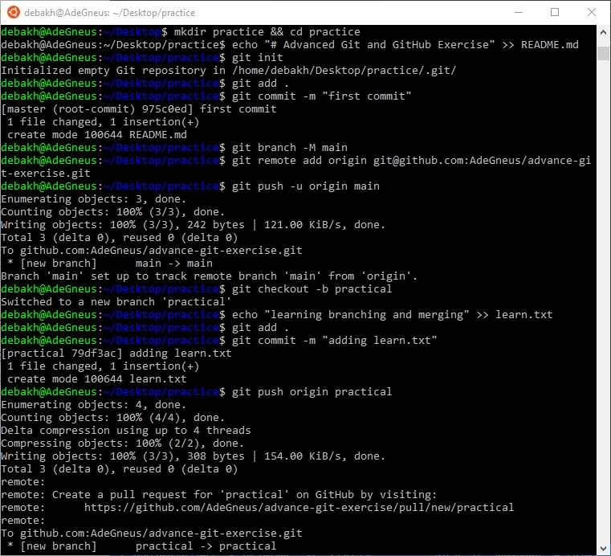
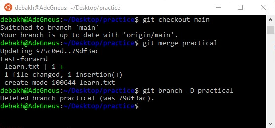
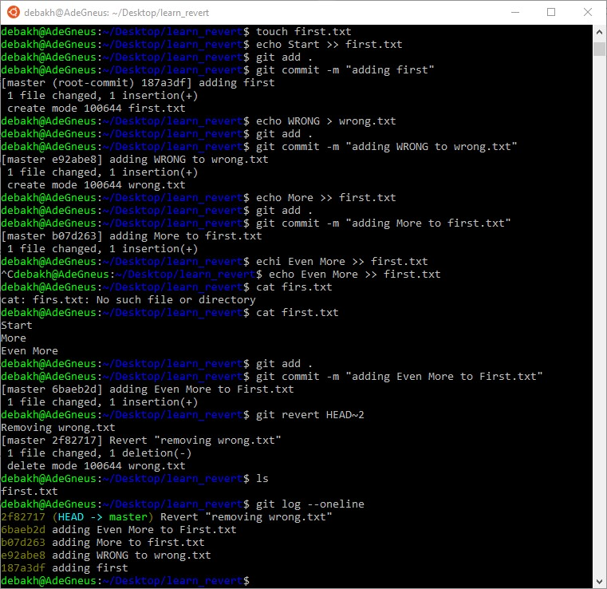
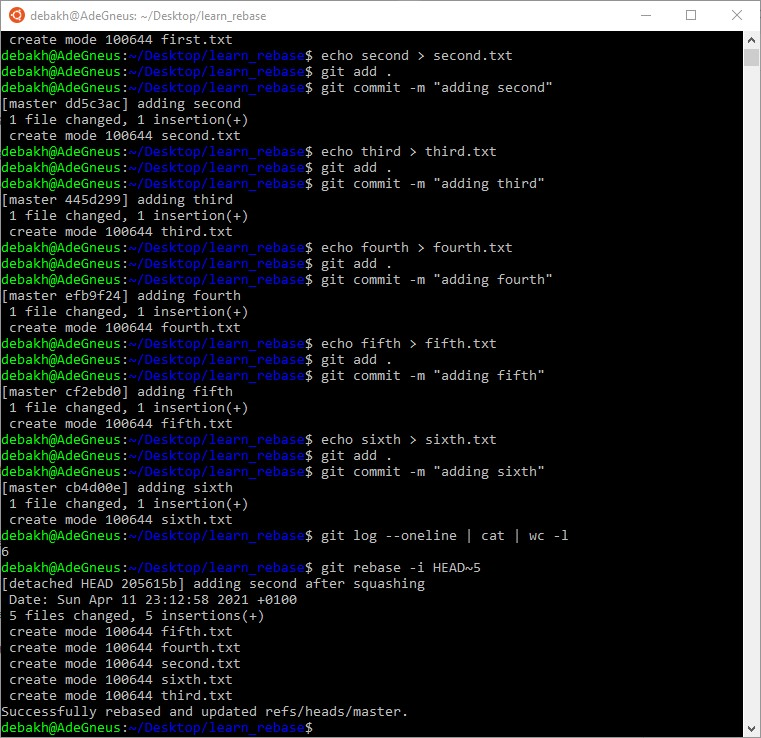

#

- For questions one to three on creating a repo and pushing to GitHub, see the images attached below

    
    

- For revert and rebase with interactive mode plus squashing see the images below

1. Revert

    

2. Rebase

    
