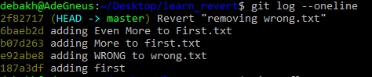

#

- For `git reset`, it removes the commit from the commmit history while `git revert` undoes the commit and append a new commit with its content.
.

    It's not advisable to use `git reset` when working with other developers as it would lead to inconsistent history, so `git revert` is favored here

- `git merge` helps to integrate changes from other branches without rewriting the commit history but it pollute the commit history by introducing another commit. `git rebase` on the other hand rewrites the commit history but gives a cleaner, linear commit history free of merging conflicts.

    `git rebase` is the best option if one is not working on a public repo while `git merge` is best for such as it gives the commit history in order.

- `git stash pop` moves the latest stashed change back into the working directory and remove it from the list while `git stash apply` moves the latest stashed change back into the working directory and keeps it on the list. `git stash apply` is desirable for reusability as it keeps the changes on the stash list.

- The `interactive` mode during rebasing allows us to edit commit message, amend commit message, squash (meld) commit messages, run shell commands, remove commits and discard commit's log message
